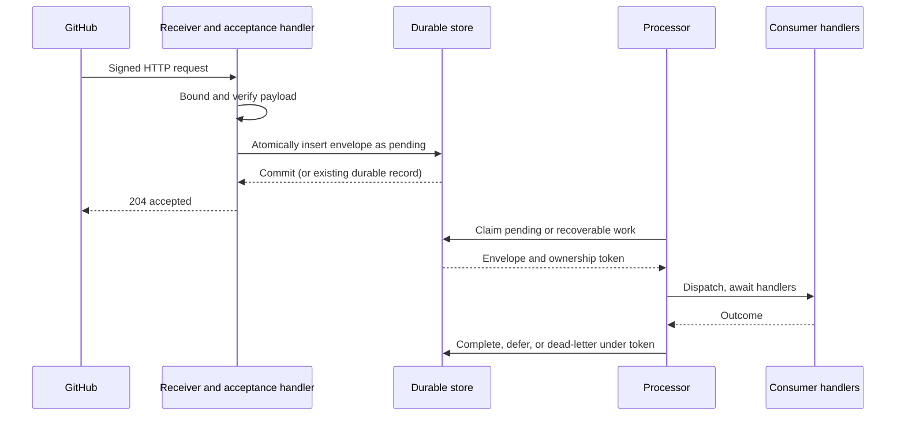

# Durable receipt and recovery

[Documentation index](../README.md#documentation)

Use this guide when handlers perform durable side effects or cannot reliably
finish during GitHub's request deadline. octoevents verifies and routes;
your application owns durable acceptance and processing.

## Choose what a successful response means

GitHub expects a response within 10 seconds and does not automatically
redeliver a failed delivery. See GitHub's
[webhook best practices](https://docs.github.com/en/webhooks/using-webhooks/best-practices-for-using-webhooks).

For short, idempotent work, you can await dispatch in the request. A 204 then
means dispatch succeeded, including an unmatched delivery with no rejecting
fallback. A 500 can follow partial side effects: earlier handlers are not
rolled back when a later handler fails.

For durable asynchronous work, use the receiver with a handler over
`Envelope` that **awaits a committed store write** and then returns `Ok(())`.
In this design 204 means *durably accepted*, not *processed*. A separate
processor loads stored envelopes and calls `Dispatcher::dispatch`.
An in-memory queue or a detached task is not a durable handoff.

## Define the store contract before implementing it

1. **Atomic acceptance.** Enforce uniqueness on the delivery ID in the
   intended receiver namespace. Insert the full envelope and its pending
   state in one transaction. If multiple webhooks/tenants share a store,
   use independently trusted configuration to choose that namespace.
   A duplicate may be acknowledged only after the original durable commit
   is established; a unique-key conflict with an uncommitted transaction is
   not yet durable acceptance.
2. **Preserve the first receipt.** Do not overwrite an existing envelope on
   redelivery. Investigate a conflicting payload under the same ID. The ID
   is unsigned, so uniqueness is not adversarial replay protection.
3. **Processing ownership.** Claim work atomically across all processors.
   One option is `pending → processing` with an expiring lease and a unique
   ownership token. Renew long-running claims and condition completion on
   that token. Expiration can allow a replacement to overlap a stalled
   original; fencing or idempotency at the side-effect boundary is still needed.
4. **Completion and recovery.** Record success only after the required effects
   finish. Preserve errors, attempt counts and next-attempt time. A crashed
   processor leaves work discoverable through pending state or expired
   ownership, rather than through a new GitHub request.
5. **Retention.** Keep deduplication records for the period your application
   intends to recognize redeliveries. Deleting them permits the same delivery
   to execute again. Define payload retention and error access for your data.

These are application storage contracts, not states or guarantees supplied
by octoevents. The
[`policy_seam` example](../examples/policy_seam.rs) shows where to put policy;
its in-memory store and inline dispatch do not implement this durable lifecycle.

## Make side effects safe to repeat

Neither a database claim nor delivery-ID deduplication gives exactly-once
external effects. A process can crash after an API request succeeds but
before recording completion.

- Prefer setting a desired state over applying an increment or appending
  an unconditionally new object.
- Use an external service's idempotency key where available. Include the
  logical operation, not just the delivery ID, when one delivery has several
  effects.
- For local database effects, commit the effect and its completion record
  together when possible. For a separate service, use a durable outbox and
  an idempotent consumer, or reconcile uncertain results before repeating.
- If redispatching the whole envelope, every previously successful handler
  must tolerate running again. Alternatively, the application can track
  individual logical operations; dispatcher handler names are diagnostic
  strings, not stable operation identifiers.

## Concurrency, deadlines and cancellation

The dispatcher awaits handlers sequentially **within one dispatch**. Separate
requests or dispatch calls may run concurrently against the same shared
handler, including on wasm when futures interleave at awaits. No ordering
across delivery IDs, per-installation serialization, or concurrency limit
is provided. Put ordering and rate/concurrency limits in your application.

The receiver installs no body-read or handler deadline. Configure these in
your transport. GitHub timing out does not establish whether the server is
still processing. Dropping a receive/dispatch future cancels further polling,
but cannot undo effects already performed. Recovery must not infer completion
from the absence of a running HTTP request.

For inline dispatch with a persisted envelope, both the request path and
recovery path must obey the same ownership protocol. Otherwise a recovery
job can repeat work while the original handler still runs.

## Operator procedure

| Situation | Action |
| --- | --- |
| Refused request | Diagnose signature, content type, required headers or body limit; no handler ran |
| Failure before durable acceptance | Fix the cause, then [request GitHub redelivery](https://docs.github.com/en/webhooks/testing-and-troubleshooting-webhooks/redelivering-webhooks) |
| Accepted work failed or stalled | Inspect the stored envelope and processing state; recover through the store's claim protocol |
| A later handler failed | Inspect earlier effects before redispatch; apply the idempotency/reconciliation policy |
| Unknown kind | Use `Outcome::matched` to decide whether to retain as a dead letter, forward, or tolerate |

Keep the delivery ID in logs and storage so GitHub's delivery record can be
correlated with processing. Reconcile pending/expired records periodically;
monitor oldest pending age and failed/dead-letter counts. A duplicate 204
must never be the only signal that unfinished work still exists.

Default `ping` deliveries bypass the handler. Set `handle_ping(true)` if your
acceptance policy must store them too. For decoding envelopes from storage,
follow the [trusted-hop rules](security.md#trusted-internal-forwarding).
